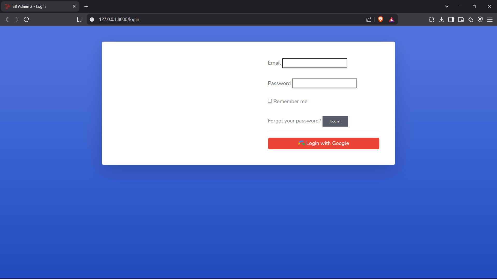
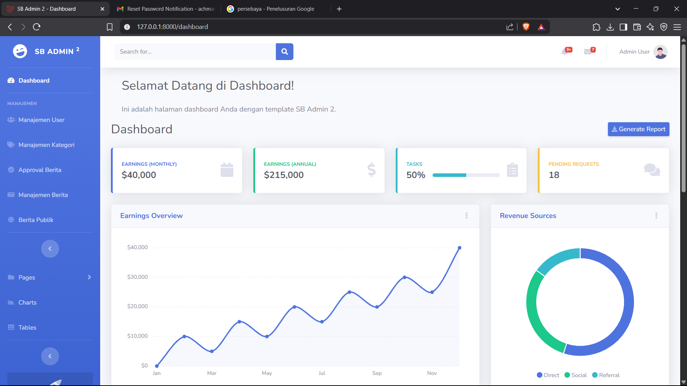
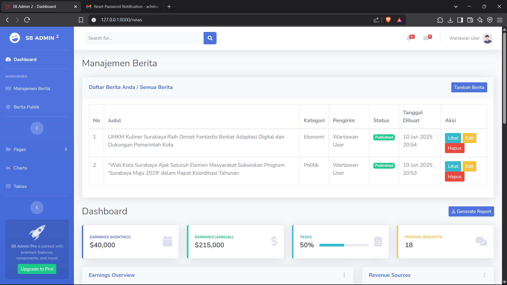
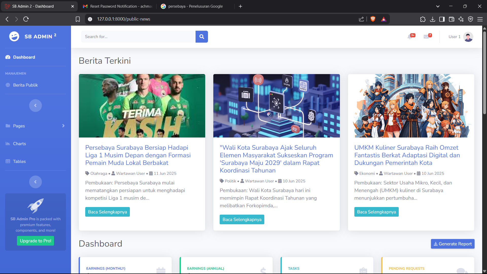
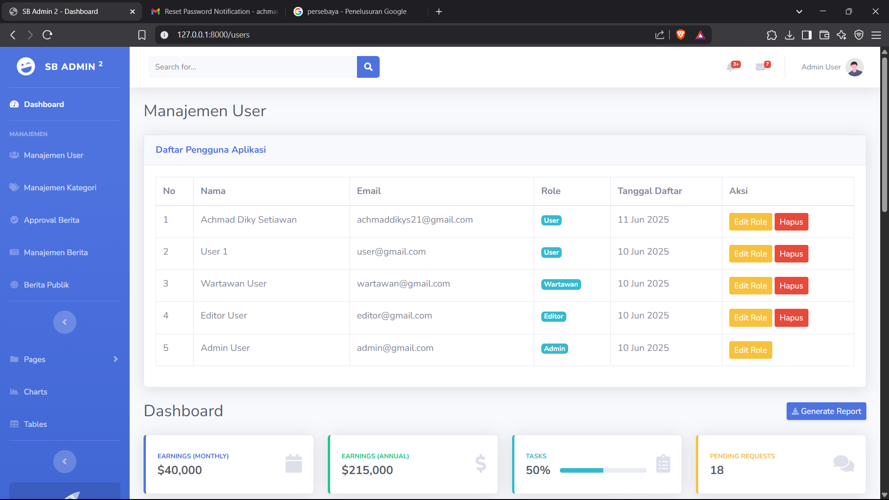
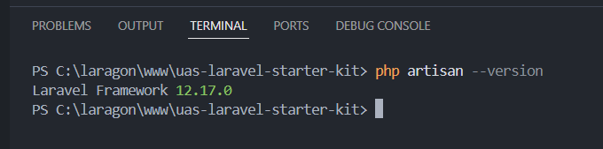

# Aplikasi Berita - UAS Pemrograman Web Lanjut

Ini adalah proyek "Starter Kit" aplikasi berita yang dikembangkan menggunakan Laravel dan Bootstrap SB Admin 2 untuk memenuhi tugas Ujian Akhir Semester (UAS) Pemrograman Web Lanjut.

## Fitur Utama

* **Autentikasi & Otorisasi (RBAC):** Login, Register, Lupa Password, Edit Profil dengan role Admin, Editor, Wartawan, dan Pengguna Biasa.
* **Login Eksternal:** Integrasi login dengan Google.
* **Manajemen Kategori:** CRUD untuk kategori berita (Admin only).
* **Manajemen Berita:** CRUD berita dengan unggah gambar, pengirim berdasarkan user yang login, dan status `Draft`.
* **Approval Berita:** Editor dapat menyetujui berita dari `Draft` menjadi `Published`.
* **Halaman Berita Publik:** Tampilan berita yang sudah `Published` untuk semua user yang login.
* **Manajemen User:** Admin dapat melihat dan mengubah role user, serta menghapus user.

## Teknologi yang Digunakan

* Laravel 12
* Bootstrap (SB Admin 2)
* MySQL
* Laravel Breeze (untuk autentikasi)
* Laravel Socialite (untuk login Google)

## Instalasi dan Setup

1.  Clone repositori ini:
    ```bash
    git clone [https://github.com/YourGitHubUsername/your-repository-name.git](https://github.com/dikysetiawan21/Laravel-News-App-UAS.git)
    cd Laravel-News-App-UAS
    ```
2.  Instal dependensi Composer:
    ```bash
    composer install
    ```
3.  Salin file `.env.example` menjadi `.env` dan konfigurasikan database serta kredensial Google:
    ```bash
    cp .env.example .env
    php artisan key:generate
    # Edit .env dengan DB_DATABASE, DB_USERNAME, DB_PASSWORD Anda
    # Tambahkan juga:
    # GOOGLE_CLIENT_ID=...
    # GOOGLE_CLIENT_SECRET=...
    # GOOGLE_REDIRECT_URI="${APP_URL}/auth/google/callback"
    ```
4.  Jalankan migrasi database:
    ```bash
    php artisan migrate --seed # --seed akan menjalankan seeder jika Anda punya
    ```
5.  Buat symlink untuk storage:
    ```bash
    php artisan storage:link
    ```
6.  Jalankan aplikasi:
    ```bash
    php artisan serve
    ```

## Demo Aplikasi

Berikut adalah tangkapan layar dari beberapa fitur utama aplikasi:

### Halaman Login


### Dashboard Admin


### Manajemen Berita


### Halaman Berita Publik


### Manajemen User (Admin)


### Dan Lain Sebagainya


---
Dibuat oleh: 
[Nama: Achmad Diky Setiawan, NIM: 23091397178, Kelas: 2023F](https://github.com/dikysetiawan21)